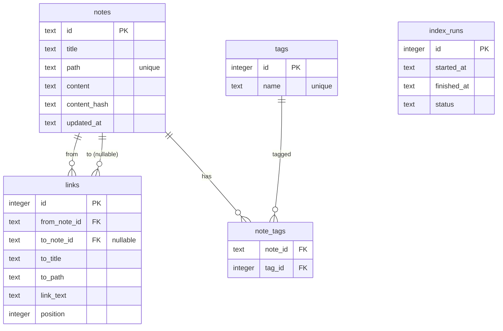

# SQLite Schema

## Overview

Markdown ノートの依存グラフ（wiki link）とメタ情報を永続化するための SQLite スキーマ。
更新は「明示的な更新バッチ」でのみ行い、検索・表示は読み取り主体とする。

## Tables

### notes

| Column       | Type | Notes                                  |
| ------------ | ---- | -------------------------------------- |
| id           | text | 主キー。安定ID（例: path の hash）     |
| title        | text | ノートタイトル                         |
| path         | text | ルート相対パス（unique）               |
| content      | text | 元Markdown（保持しない場合は空でも可） |
| content_hash | text | 変更検知用                             |
| updated_at   | text | ISO8601                                |

### links

| Column       | Type    | Notes                               |
| ------------ | ------- | ----------------------------------- |
| id           | integer | 主キー（auto increment）            |
| from_note_id | text    | 参照元ノート                        |
| to_note_id   | text    | 参照先ノート（未解決なら null）     |
| to_title     | text    | `[[Title]]` の生文字列              |
| to_path      | text    | 解決後のパス（任意）                |
| link_text    | text    | 表示名（`[[Title\|Label]]` を想定） |
| position     | integer | ソース内位置（任意）                |

### tags / note_tags

tags は `name` を unique に保ち、note_tags で多対多を表現。

### index_runs

明示的な更新バッチの実行履歴を管理する。

## DDL

```sql
create table notes (
  id            text primary key,
  title         text not null,
  path          text not null unique,
  content       text not null,
  content_hash  text not null,
  updated_at    text not null
);

create table links (
  id            integer primary key autoincrement,
  from_note_id  text not null,
  to_note_id    text,
  to_title      text not null,
  to_path       text,
  link_text     text,
  position      integer,
  foreign key (from_note_id) references notes(id) on delete cascade,
  foreign key (to_note_id) references notes(id) on delete set null
);

create table tags (
  id   integer primary key autoincrement,
  name text not null unique
);

create table note_tags (
  note_id text not null,
  tag_id  integer not null,
  primary key (note_id, tag_id),
  foreign key (note_id) references notes(id) on delete cascade,
  foreign key (tag_id) references tags(id) on delete cascade
);

create table index_runs (
  id          integer primary key autoincrement,
  started_at  text not null,
  finished_at text,
  status      text not null
);

create index idx_notes_title on notes(title);
create index idx_links_from on links(from_note_id);
create index idx_links_to on links(to_note_id);
create index idx_tags_name on tags(name);
```

## ER Diagram



## Update Batch Process

明示的な更新バッチのみが DB を更新する。UI/表示は読み取り専用。

### Full Rebuild

1. `index_runs` に `running` を追加
2. 対象ディレクトリを走査して Markdown を読み込む
3. `notes` を upsert（`content_hash` で更新判定）
4. `links` / `tags` / `note_tags` を全量再作成
5. `index_runs` を `success` で完了

### Incremental Update

1. `index_runs` に `running` を追加
2. `content_hash` を比較し、変更ファイルのみ抽出
3. 変更ファイルの `notes` を upsert
4. 該当ノートの `links` / `note_tags` を削除して再作成
5. `index_runs` を `success` で完了

### Failure Handling

- 失敗時は `index_runs.status = failed` に更新
- UI 側は最新の `success` のみを参照
